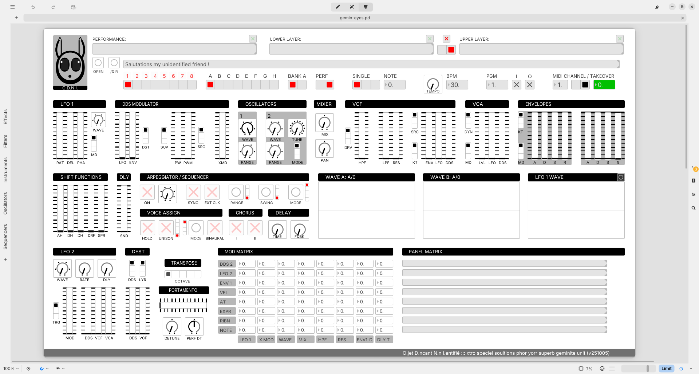

# O.D.N.I. 

## gemin-eyes.pd, v251005

A W.I.P. Pure Data Patch for displaying U.D.O. Super Gemini patches/performances, featuring "takeover" mode for smooth control transitions. 



To get started we recommend:

0) Using [plugdata](https://github.com/plugdata-team/plugdata), which is the form of [puredata](https://github.com/pure-data/pure-data) this patch was made in. This should ensure the gui displays correctly (font sizes don't always translate so well). Gui is not really what PD is about, so you will probably find this aspect quite limited. You should be able to zoom in and out and move around. You can collapse the side bar. **Make sure you're not in (ctrl+E) EDIT mode!** (either RUN mode, else select "presentation mode" - the display icon in the top bar (though this will disappear comments.))

1) Making the following settings on your Gemini: LOCAL OFF, TX/RX P = 1 & 2 on, TX/RX E = 1 & 2 on, 3 off, PERF mode selected. Also making sure that - settings menu, midi tab - the SG is recognised and midi in/out is enabled.

2) Pressing the /DIR button and selecting your mounted GEMINI drive from the pop up.

3) Selecting a performance (pgm) either via the SG or ODNI. You should see the gui update if everything is set up correctly.

4) Moving a fader on the SG. You will see that TAKEOVER is enabled by default, while the number is red the midi data is being intercepted and will not be allowed to pass until it hits or crosses the threshold of the stored value. The number will be positive or negative to show in which direction you need to move, and will turn green once takeover is complete. This prevents sudden jumps when changing programs, it only applies to the continuous controls (not the switches), and can be disabled via the radio button.

5) If you have the ODNI midi channel set the same as your SG, you will also note that the display automatically updates depending on which layer's controls you are using. This can be disabled by unchecking the box above the layer select radio button.

6) SG only transmits and receives pgm changes in PERF mode, thus if you select PATCH in ODNI, PGM I/O will be disabled and upper layer only will be enforced (necessary atm). Takeover mode will still work if enabled.

7) Setting a directory points ODNI at a root folder that contains further folders that follow the SG drive structure, i.e. /patch_banks_a and so on. But you can also simply click the OPEN button to open an individual file - ODNI will know automatically if it is a patch or performance according to the file extension, and the appropriate mode will be set.

8) The GUI at present is only there to give a visual indication of how the panel would look for the selected patch/performance. It should be pretty accurate, with the exception of the TUNE knob which we still hasn't quite figured out.

9) The panel matrix is not yet implemented but the standard mod matrix is. It displays +- in % ... however, we assumed scaling was linear, and it appears that in fact at least some of the time a power law is being used, so will take further work to achieve accuracy.

10) This is the first version of this tool. It is something we is experimenting with for our own nefurious porpoises and is being shared without our being under any particuliar obligations to manyone. Perhaps after a few cycles when it achieves some kind of maturity there will be an option to donate to our (just be)cause for mutual happinessies. Until then just have a fiddle around and if you want to talk use the thread at the udo forums: [Uncle Wayback's Ultra Gemini Thread.](https://forum.udo-audio.com/t/uncle-waybacks-ultra-gemini-thread/3602)

11) Personally we finds takeover mode the most useful bit, and may move in the direction of modularisation, to provide something more like a suite of patches that can then be used more flexibly. This is the first phase in our explorations of getting a little deeper with our Gemini. Our main aim is less on the editor side and more on the side of extended functionality - like for instance we want to make some more machines and be able to associate their states with saved SG perfs, to add stuff like macros and snapshots. We shall see (shells on the SSEAA, sure). Under & In & Over & Out.

P.S. ODNI only *reads* files atm, we do plan to offer some limited write abilities, though this won't be possible "live" as the SG has to be rebooted while holding PATCH for the drive to be write enabled. However it will work for file management on your computer. The first thing will be baking the names/titles into the files (that's what the green toggles above the symbol boxes will be for: when they are lit it will mean the displayed symbol is written to file). Other than that who knows!

```

             .           .
            /\           /\
           |^/           \^|
           |(             )|
           (\             /)
            \\  __...__  //
             \\/       `//
             '   ^   ^   \
             ( (o | | o) )
              \ ` | | /
               `    '
                 ` o
        ^   ^ ^   `.
        \\ ||//    .
         \\_|/    _.
         //-/    /  \
          ` \   /   |
            \\_/   |

           O.D.N.I

   xtro speciel soulwtionz
   phor yur     superb
                geminite units

_________________________________
s@m iamalonebutwearenot d.t quomk

```
