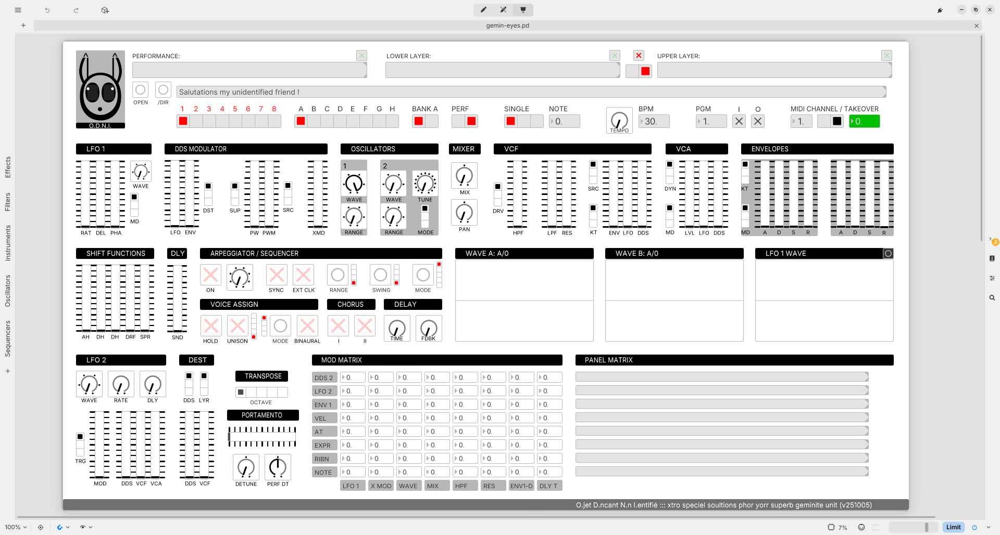

# O.D.N.I. 

## gemin-eyes.pd, v251012

A W.I.P. Pure Data Patch for displaying [U.D.O. Super Gemini](https://www.udo-audio.com/) patches/performances, featuring "takeover" mode for smooth control transitions. (No reason why it won't also work for the Super 8 - I just don't have one.)



This patch is intended to be opened using [plugdata](https://github.com/plugdata-team/plugdata), it uses all vanilla objects but may not display correctly in [puredata](https://github.com/pure-data/pure-data) due to disparity in how fonts are handled.

Its primary aim is to give you an accurate reflection of how the Super Gemini panel would look for any given patch or performance file.

Most of the GUI is thus dedicated to this end: it is for reading rather than interacting with. The exceptions are some of the controls at the top of the patch. I will run through them, top to bottom and left to right:

1. The very top bar is dedicated to showing the names that are embedded in the files. Each box has a green "toggle" button above it. These boxes will be checked when the strings they display are written to file (i.e. when freshly loaded). ODNI allows names entered in the boxes (limited to 32 characters) to be written to file. To do this you first enter a name, the toggle will be turned off when you press enter, indicating the name is ready to be written, when you click the toggle box it will write the name to file, and you will get a message indicating success in the message box below. Please note that you will not be able to write to the Gemini drive itself in normal use, as it is write protected. The write function is intended for files in folders on your computer.

2. Between the lower and the upper layer names is a red "radio" button with two choices. This is used to select which layer you are viewing. If the red toggle just above it is checked, the layer will be switched automatically depending on which midi channel is last received (i.e. what control you moved last on what layer).

3. Perhaps the most important controls are on the next line down: the two "bang" buttons beside the ODNI logo. The button labelled OPEN will open a dialogue where you can select the file you want to read (.usg/.xsg). The button labelled /DIR will enable you to select a directory, used for pointing ODNI at a root directory (the folder in which you would find subfolders such as /patch_banks_a, /performances_b, &c.) If you are using the patch with your SG connected you can point this at the drive itself (so long as it is mounted). This will enable a limited degree of syncronisation, as we will detail.

4. Next to the OPEN buttons is the message box, where messages will be printed indicating success or failure of requested functions.

5. On the third and final line we have a series of red radio buttons that you may recognise from your SG. They are used for displaying and/or indicating which patch or performance is currently loaded. If you are in PERF mode (the 4th radio button), you will have the option of syncronising using Program Change messages. The SG only supports Program Change for Performances at present. Only when you select an option from the first radio, labelled 1-8, will a patch/perf be loaded (just like on the SG). When you change A-H you will see that the numbers 1-8 will be either red or black - red if a file is saved to that slot, black if not.

6. After the PGM select buttons are a series of "read only" buttons indicating Performance based parameters: layer mode, split note, tempo (perhaps non-functional atm), bpm.

7. Then we come to the Program Syncronisation section. The number box indicates the value of the current program and also sets it if changed. The two toggles are for switching on/off the reception (I=in) or transmission (O=out) of midi program change messages. These functions are also dependent on settings on your SG (TX/RX P = 1 & 2 on).

8. Finally we have the controls relating to MIDI TAKEOVER MODE. This mode prevents midi cc messages from passing until the threshold of the saved value has been passed. It only applies to the continuous controls, not the switches. It depends on the following settings being made on the SG: LOCAL OFF, TX/RX E = 1 & 2 on (3 off). It works best with PERF mode selected on the SG and ODNI using PGM SYNC I/O, and automatic layer switching. We must also be sure to set the channel the same as our SG (defaults to 1). The toggle sets takeover on/off. If set up like so it should all work automatically (the working directory (/DIR) can either be your Super Gemini drive or a mirrored folder on your computer, if you want write enabled). The number box gives an indication of the state of the control last touched. When it is red it means takeover has not yet occurred. The value will be negative if the fader is below the target value, positive if above. Once takeover is achieved the number box will be green. It will continue to display the difference between current position and stored value. (It will be grey if a non-applicable control is being operated.)

9. That's all! (For now, at least.)

### Troubleshooting/further comments:

- If you are having problems do check that the file path in the message box matches your expectations, if not try reloading the patch/performance - in some cases it seems to drop the first request (I'll work on this).
- If you are updating files on your SG drive live, I am not 100% sure they will display immediately (that is, upon reloading the file via ODNI in the same session) - in my tests I sometimes had to unmount and remount the drive to get it to recognise live changes (again, I'll work on it).
- If you are in patch mode things like PGM sync and auto layer switching will be disabled (due to limitations of the SG's midi implementation) and ODNI will treat the patch as if the upper layer, regardless of settings on your SG.
- I have noticed a funny thing with the waveform display, which only happens in the event of the NOISE waveform being selected: sometimes the depicted waveform will not correspond, i.e. it will show a square or a triangle while the label above says NOISE. I don't know why this happens but it appears that in this event you should trust the label and not the waveform that is stored with the patch.
- I had hoped we could make a kind of "battwave" hack by loading .ws6 files into the LFO 1 slot, but in my tests this didn't work: we will have to keep on at UDO to implement it as a feature, just as it is on the Super 6.
- The mod matrix now turns pink in whatever slot it finds a non-zero value, helping you to see what has been set at a glance - unfortunately the mod matrix appears to use a mix of linear and non-linear scaling and the percentage displayed in the box may not match that suggested by the unit - however it *will* serve as an accurate reflection of what sources and destinations are engaged.
- Beside the mod matrix are a series of message boxes in which any PANEL MATRIX DESTINATIONS will be displayed. No values are provided, but again: it will give you accurate feedback on what is set. (To change a panel matrix value you do the same as you would to set it: hold the source and move the fader of the destination, then use the encoder to change the value.)
- I hope you find this patch of some use! I can only provide limited support but please do use the thread at the UDO forums for questions/feedback:  [Uncle Wayback's Ultra Gemini Thread.](https://forum.udo-audio.com/t/uncle-waybacks-ultra-gemini-thread/3602)

```

             .           .
            /\           /\
           |^/           \^|
           |(             )|
           (\             /)
            \\  __...__  //
             \\/       `//
             '   ^   ^   \
             ( (o | | o) )
              \ ` | | /
               `    '
                 ` o
        ^   ^ ^   `.
        \\ ||//    .
         \\_|/    _.
         //-/    /  \
          ` \   /   |
            \\_/   |

           O.D.N.I

   xtro speciel soulwtionz
   phor yur     superb
                geminite units

_________________________________
s@m iamalonebutwearenot d.t quomk

```
